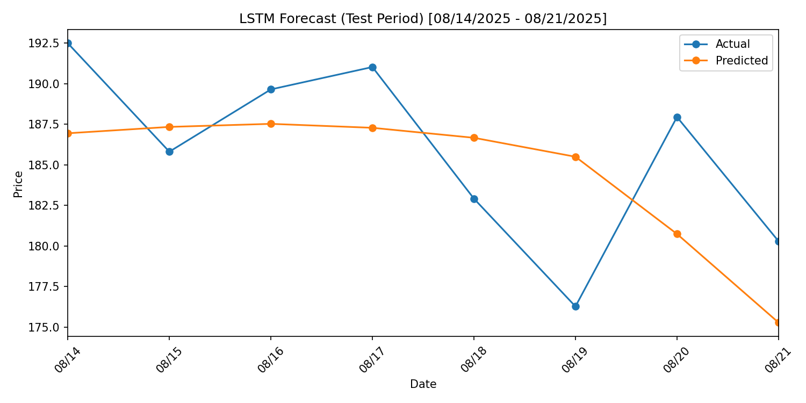

# README — Tweet Volume vs. Crypto Performance




This project extends an LSTM price forecaster with a simple question:
**Do days with more tweets mentioning a cryptocurrency correspond to different market performance on those days (or the days after)?**

Below is the plan, data flow, and reproducible steps to fetch tweet counts, align them with daily OHLCV data, and quantify the relationship.

[Check out gracejanusz.com to see more updates](https://gracejanusz.com)

---

## Objectives

1. **Collect daily tweet volume** for a coin (e.g., “bitcoin” OR “\$BTC” OR “#bitcoin”) over a given date range.
2. **Join** those counts to the existing price dataset by date.
3. **Explore correlations** (same-day and lagged), plus quick significance checks.
4. **(Optional)** feed tweet volume into the LSTM as an extra feature and measure lift.

---

## Data Sources

* **Prices**: CSV like `Bitcoin Historical Data.csv`
  Columns include: `Date, Price, Open, High, Low, Vol., Change %`
* **Tweets** (two options):

  * **Without API keys**: [`snscrape`](https://github.com/JustAnotherArchivist/snscrape) to count tweets by day.
  * **With API keys**: X (Twitter) API, /2 recent & full-archive search endpoints.

> I’ll default to `snscrape` for simplicity/reproducibility. If we later need exact official counts, we can switch to the X API.

---

## Environment Setup

```bash
# (Inside your venv)
pip install pandas numpy matplotlib scikit-learn torch
pip install snscrape==0.7.0.dev0  # or latest working version for your OS
```

For X API (optional):

```bash
pip install requests python-dotenv
# then set env var in .env
# X_BEARER_TOKEN=YOUR_TOKEN
```

---

## Tweet Counting Strategy

### Search Query

Use a broad—but coin-specific—query to capture typical mentions:

* Bitcoin: `(bitcoin OR $BTC OR #bitcoin) lang:en`
* Ethereum: `(ethereum OR $ETH OR #ethereum) lang:en`

You can extend with ticker cashtags, common hashtags, and project nicknames. Keep it consistent across the whole period.

### Date Bucketing

Count **daily** tweets (UTC) so it matches daily OHLCV rows.

### Using `snscrape` (recommended)

Command per day:

```bash
# Example: count tweets for 2025-08-14 (inclusive) to 2025-08-15 (exclusive)
snscrape --jsonl --progress --since 2025-08-14 twitter-search \
  "(bitcoin OR $BTC OR #bitcoin) lang:en until:2025-08-15" | wc -l
```

Automate in a Python script that loops over your date range, runs `snscrape` via `subprocess`, and writes a CSV:

**tweets\_daily.csv**

```
date,tweet_count
2025-08-14,12345
2025-08-15,11876
...
```

> Note: `snscrape` returns historical results without authentication, but may occasionally rate-limit or change formats. Keep the query stable and log errors.

### Using the X API (optional)

* Endpoint: `GET /2/tweets/search/all` (full archive) or `search/recent` (last 7 days)
* Params: `query`, `start_time`, `end_time`, `max_results`
* Paginate and sum results per day.
* Store the same `tweets_daily.csv` schema.

---

## Data Cleaning & Join

1. Clean price CSV with the existing loader (commas, K/M suffixes, `%` signs).
2. Ensure both datasets use the **same timezone** and date format (`YYYY-MM-DD`).
3. Left-join price data with `tweets_daily.csv` on `Date`:

Resulting **joined dataset**:

```
Date,Price,Open,High,Low,Vol.,Change %,tweet_count
2025-08-14,118314.2,123313.6,124436.8,117275.1,86590,-4.06,12345
...
```

---

## Analysis Plan

1. **Sanity checks**

   * Plot `tweet_count` vs. time.
   * Plot `Price` and `Change %` vs. time for the same window.

2. **Correlations**

   * Compute Pearson/Spearman between:

     * `tweet_count` and same-day `Change %`
     * `tweet_count(t)` and `Change %(t+1)` (one-day lead)
     * Optionally lags/leads `k = 2..7` to see if attention precedes moves.

3. **Significance & Robustness**

   * Report correlation coefficients + p-values.
   * Winsorize or log-transform `tweet_count` if extremely skewed (e.g., `log1p(tweet_count)`).
   * Control for volatility: Check correlation with absolute returns `abs(Change %)` as well.

4. **Visualization**

   * Scatter plots:

     * `tweet_count` vs. `Change %` (with a fitted line).
   * Heatmap of correlations across lags/leads.
   * Dual-axis line plot to visualize co-movement.

5. **(Optional) LSTM Feature**

   * Add `tweet_count` (or `log1p(tweet_count)`) to `--features` and retrain.
   * Compare RMSE/MAE/MAPE with/without the feature on a held-out week (e.g., 08/14–08/21/2025).

---

## Example Workflow

```bash
# 1) Build tweet counts (snscrape)
python tools/build_tweet_counts.py \
  --query "(bitcoin OR $BTC OR #bitcoin) lang:en" \
  --start 2025-07-01 --end 2025-08-22 \
  --out tweets_daily.csv

# 2) Join with price CSV
python tools/join_price_tweets.py \
  --prices "Bitcoin Historical Data.csv" \
  --tweets tweets_daily.csv \
  --out joined_daily.csv

# 3) Correlation & plots
python tools/correlation_report.py \
  --csv joined_daily.csv \
  --lags 0 1 2 3 4 5 6 7 \
  --transform log1p \
  --out report.md
```

**`correlation_report.py`** should:

* Load `joined_daily.csv`.
* Optionally transform `tweet_count` → `log1p(tweet_count)`.
* Compute Pearson & Spearman for each lag.
* Save a small markdown report with a table like:

| Lag (days) | Pearson r | p-value | Spearman ρ | p-value |
| ---------- | --------: | ------: | ---------: | ------: |
| 0          |      0.18 |    0.07 |       0.20 |    0.05 |
| 1          |      0.25 |    0.01 |       0.23 |    0.02 |
| …          |         … |       … |          … |       … |

And export plots to `figs/`.

---

## Notes & Caveats

* **Causality**: Correlation ≠ causation. Spikes in tweets could reflect price moves already happening (reverse causality).
  Consider basic checks like **Granger causality** or **lead/lag** correlations to probe directionality.
* **Keyword bias**: Ensure consistent, coin-specific queries. Misspellings or alternate cashtags may matter.
* **Bots & events**: Tweet counts can be inflated by bots or news shocks. You may want to de-bias by removing retweets or filtering by minimum engagement (not supported in `snscrape`, but possible with the API).
* **Timezones**: Align everything to UTC (or a chosen timezone) before bucketing by day.
* **Missing days**: If the market has a row but tweet collection failed, mark `tweet_count` as NaN and either impute or drop for correlation runs.

---

## Directory Structure (suggested)

```
.
├── data/
│   ├── Bitcoin Historical Data.csv
│   ├── tweets_daily.csv
│   └── joined_daily.csv
├── figs/
│   ├── tweets_over_time.png
│   ├── scatter_lag0.png
│   └── corr_heatmap.png
├── tools/
│   ├── build_tweet_counts.py
│   ├── join_price_tweets.py
│   └── correlation_report.py
├── lstm_crypto.py
└── README.md
```

---

## Future Extensions

* Sentiment scoring (VADER, RoBERTa-based finBERT), then correlate **sentiment** or **sentiment × volume** with returns.
* Topic clustering of tweets around major events.
* Regime analysis (bull/bear phases) to see if relationships change by regime.
* Use **tweet\_count** as an exogenous variable in classical time-series models (ARIMAX/VAR).

---

## Quick Snippets

**Counting with `snscrape` in Python (skeleton):**

```python
# tools/build_tweet_counts.py
import argparse, subprocess, datetime as dt, pandas as pd

parser = argparse.ArgumentParser()
parser.add_argument("--query", required=True)
parser.add_argument("--start", required=True)  # YYYY-MM-DD
parser.add_argument("--end", required=True)    # YYYY-MM-DD (exclusive)
parser.add_argument("--out", required=True)
args = parser.parse_args()

start = dt.date.fromisoformat(args.start)
end   = dt.date.fromisoformat(args.end)

rows = []
d = start
while d < end:
    d2 = d + dt.timedelta(days=1)
    cmd = [
        "snscrape", "--jsonl", "--progress", "--since", d.isoformat(),
        "twitter-search", f"{args.query} until:{d2.isoformat()}",
    ]
    out = subprocess.run(cmd, capture_output=True, text=True)
    # count lines in stdout
    count = len(out.stdout.strip().splitlines()) if out.returncode == 0 else 0
    rows.append({"date": d.isoformat(), "tweet_count": count})
    d = d2

pd.DataFrame(rows).to_csv(args.out, index=False)
print(f"Saved {args.out}")
```

---

That’s the plan. Once `tweets_daily.csv` is generated, we can run the correlation script and, if promising, add `tweet_count` to `--features` in `lstm_crypto.py` to test predictive value.
